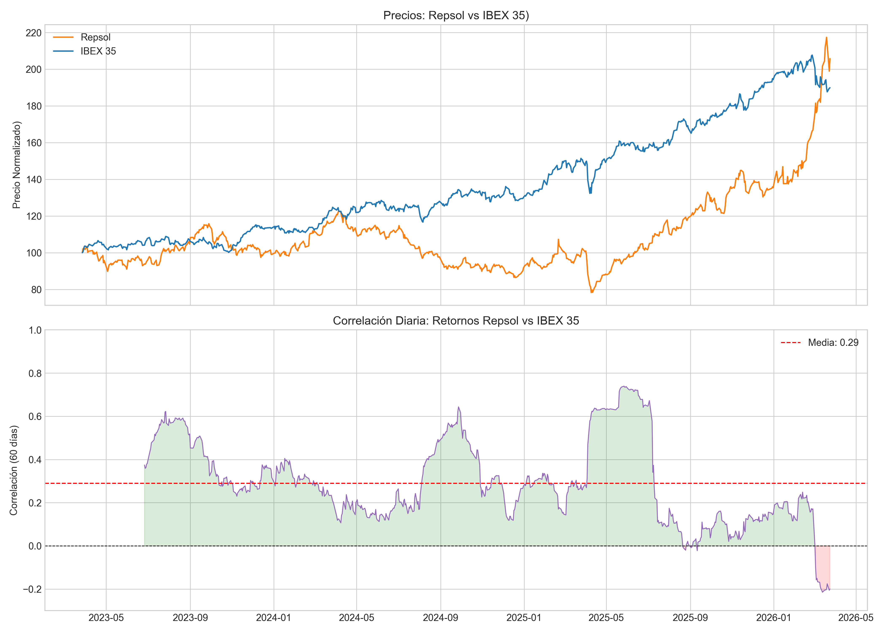
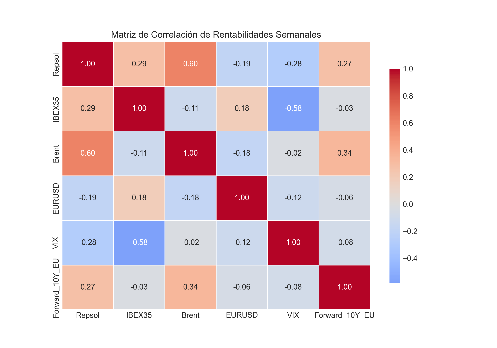
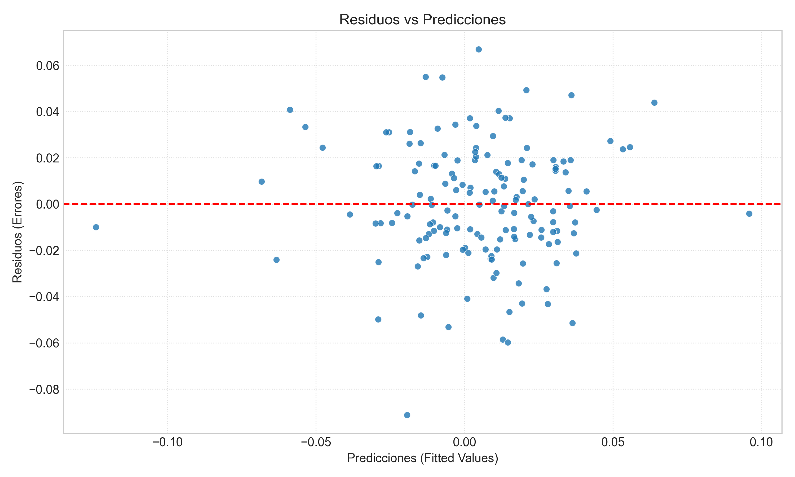
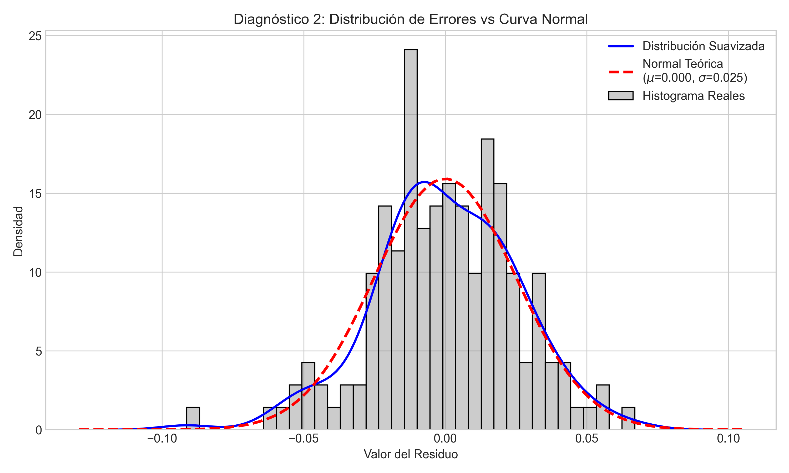

# Actividad 1 — Regresión OLS: Factores macro que explican los retornos de Repsol

**Notebook:** [`actividad1.ipynb`](actividad1.ipynb)

## Objetivo

Analizar qué variables macro-financieras explican la rentabilidad semanal de **Repsol (REP.MC)**
mediante un modelo de regresión lineal múltiple (OLS), evaluando la validez estadística del modelo
(multicolinealidad, normalidad y homocedasticidad de los residuos).

## Datos

Periodo 2023-03-27 a 2026-03-24, descargado con `yfinance` + curva forward de tipos a 10 años (EU)
desde un fichero propio (`yield_curve.tsv`). Variables utilizadas:

| Variable | Descripción |
|---|---|
| `Repsol` (REP.MC) | Variable dependiente (target) |
| `IBEX35` | Mercado de referencia español |
| `Brent` (BZ=F) | Petróleo Brent — ~25-30% de los costes operativos de Repsol |
| `EURUSD` | Tipo de cambio |
| `VIX` | Volatilidad implícita / apetito de riesgo |
| `Forward_10Y_EU` | Curva forward de tipos de interés a 10 años en la Eurozona |

## Teoría y metodología

1. **Fase 1 — Recolección y limpieza**: descarga diaria, unión por fechas comunes, normalización
   base 100 para comparar evolución de precios.
2. **Fase 2 — Transformación a semanal y estimación OLS**: los precios se convierten a
   rentabilidades (`pct_change`) y los tipos de interés a variaciones en puntos básicos (`diff`).
   Se estima:

   `Ret_Repsol = β₀ + β₁·Ret_IBEX35 + β₂·Ret_Brent + β₃·Ret_EURUSD + β₄·Ret_VIX + β₅·Δtipos_10Y + ε`

3. **Fase 3 — Diagnóstico del modelo**:
   - **VIF (Variance Inflation Factor)**: mide si una variable está muy correlacionada con una
     combinación lineal del resto (multicolinealidad). VIF > 5 suele indicar que el coeficiente y su
     p-value dejan de ser fiables.
   - **Residuos vs predicciones**: para detectar heterocedasticidad (varianza del error no
     constante).
   - **Distribución de residuos vs normal teórica**: para contrastar el supuesto de normalidad de
     los errores (curtosis, asimetría).

## Resultados principales

**Regresión OLS** (R² = 0.520, R² ajustado = 0.504, F-stat p-value ≈ 2.3e-22):

| Variable | Coef. | p-value | Interpretación |
|---|---|---|---|
| IBEX35 | **+0.600** | 0.000 | Repsol se mueve con el mercado español (beta > 0) |
| Brent | **+0.459** | 0.000 | Fuerte sensibilidad positiva al precio del petróleo |
| EURUSD | **-0.565** | 0.011 | Un euro más fuerte perjudica (ingresos en USD) |
| VIX | -0.017 | 0.271 | No significativo |
| Forward_10Y_EU | +0.0002 | 0.244 | No significativo |

- **VIF**: todos los valores entre 1.07 y 1.58 → **no hay multicolinealidad relevante**, los
  coeficientes y p-values son fiables.
- **Residuos**: dispersión aleatoria alrededor de 0 sin patrón → no hay heterocedasticidad.
- **Distribución de residuos**: forma leptocúrtica (más apuntada y con colas más pesadas que la
  normal teórica), es decir, hay más días con sorpresas grandes de lo que predice una normal.

### Conclusión

El Brent y el IBEX35 son los factores que más explican el retorno semanal de Repsol, seguido del
tipo de cambio EUR/USD (con signo negativo). El VIX y los tipos de interés no aportan poder
explicativo significativo en este periodo.

## Gráficos

| | |
|---|---|
|  |  |
|  |  |
|  | |
