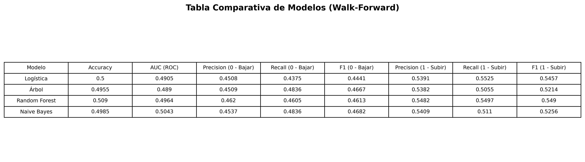
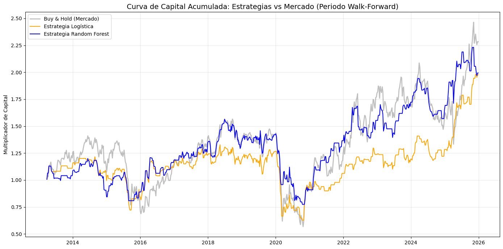
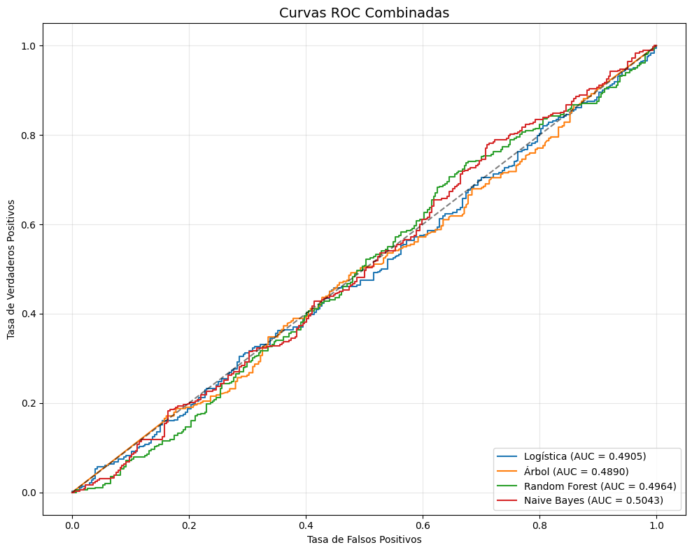
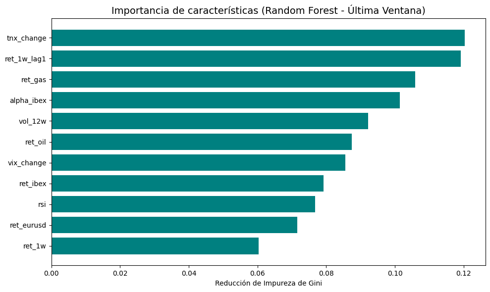

# Actividad 2 — Predicción de la dirección semanal de Repsol con Machine Learning

**Notebook:** [`act2_alejandro.ipynb`](act2_alejandro.ipynb)

## Objetivo

Comprobar si distintos modelos de clasificación son capaces de predecir si **Repsol (REP.MC)**
subirá o bajará la semana siguiente, usando variables macro (petróleo, gas, IBEX35, EUR/USD, VIX,
tipos a 10 años) e indicadores técnicos, validado con un esquema **walk-forward** (out-of-sample
real, sin look-ahead bias).

## Datos y features

Datos semanales desde 2010 (`yfinance`): `REP.MC`, `CL=F` (petróleo), `NG=F` (gas), `^IBEX`,
`EURUSD=X`, `^VIX`, `^TNX`.

Variables construidas:
- Retornos semanales de Repsol, petróleo, gas, IBEX, EUR/USD
- Variaciones semanales del VIX y del TNX (tipos 10Y)
- `alpha_ibex`: retorno de Repsol menos retorno del IBEX (rentabilidad relativa al mercado)
- `ret_1w_lag1`: retorno de la semana anterior (momentum/reversión)
- `vol_12w`: volatilidad móvil de 12 semanas
- `rsi`: RSI (14 periodos) calculado vía medias móviles exponenciales de ganancias/pérdidas

**Target**: 1 si Repsol sube la semana siguiente, 0 si baja o se mantiene (clasificación binaria).

## Teoría y metodología

- **Walk-forward validation (ventana móvil de 156 semanas ≈ 3 años)**: en cada paso se entrena con
  las últimas 156 semanas y se predice solo la semana siguiente, desplazando la ventana hacia
  delante. Esto evita el error de usar información futura en el entrenamiento (look-ahead bias),
  a diferencia de un *k-fold* clásico que mezclaría pasado y futuro.
- **Escalado dinámico**: el `StandardScaler` se reajusta en cada ventana con los datos de
  entrenamiento de ese momento (no se usa un escalado global fijo).
- **Modelos comparados**: Regresión Logística, Árbol de Decisión, Random Forest y Naive Bayes
  (todos con balanceo de clases, `class_weight='balanced'`).
- **Métricas**: Accuracy, AUC-ROC, Precision/Recall/F1 de la clase "sube", matrices de confusión,
  curva de capital acumulada vs Buy & Hold, e importancia de variables (Random Forest).

## Resultados principales

| Modelo | Accuracy | AUC (ROC) | Precision (1) | Recall (1) | F1 (1) |
|---|---|---|---|---|---|
| Logística | 0.500 | 0.4905 | 0.5391 | 0.5525 | 0.5457 |
| Árbol | 0.4955 | 0.4890 | 0.5382 | 0.5055 | 0.5214 |
| Random Forest | 0.509 | 0.4964 | 0.5482 | 0.5497 | 0.5490 |
| Naive Bayes | 0.4985 | 0.5043 | 0.5409 | 0.5110 | 0.5256 |

### Conclusión

El AUC de todos los modelos ronda **0.49-0.50**, es decir, prácticamente igual que lanzar una
moneda: ninguno de los 4 algoritmos logra un poder predictivo real sobre la dirección semanal de
Repsol con este conjunto de variables. Esto es coherente con la **hipótesis de mercado eficiente en
su forma débil**: con información pública (precios, macro, técnicos) no se consigue batir al azar
de forma consistente a una semana vista. En la curva de capital, Random Forest sigue de cerca al
Buy & Hold sin superarlo de forma robusta, y la curva ROC de todos los modelos se solapa con la
diagonal de un clasificador aleatorio.

Entre las variables más influyentes para el Random Forest destacan `tnx_change`, `ret_1w_lag1` y
`ret_gas`, aunque ninguna domina de forma clara (importancias muy repartidas).

## Gráficos

| | |
|---|---|
|  |  |
|  |  |

> Nota: las matrices de confusión de los 4 modelos están disponibles dentro del notebook
> (no se exportaron como imagen suelta).
