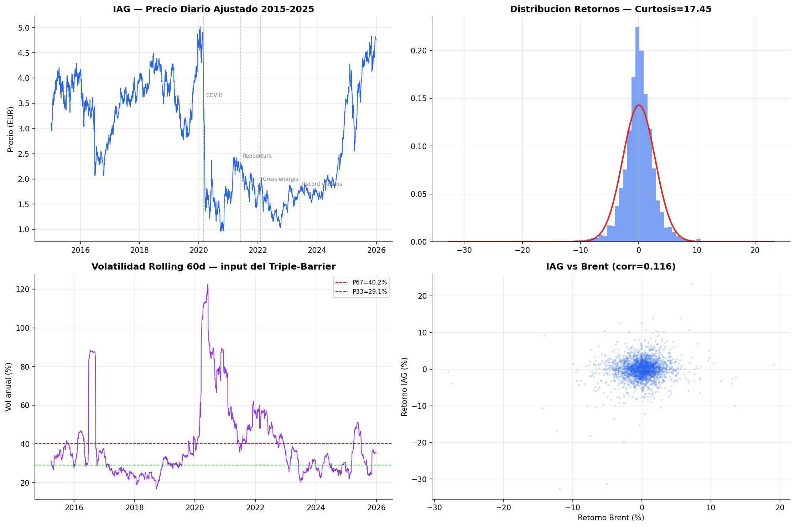
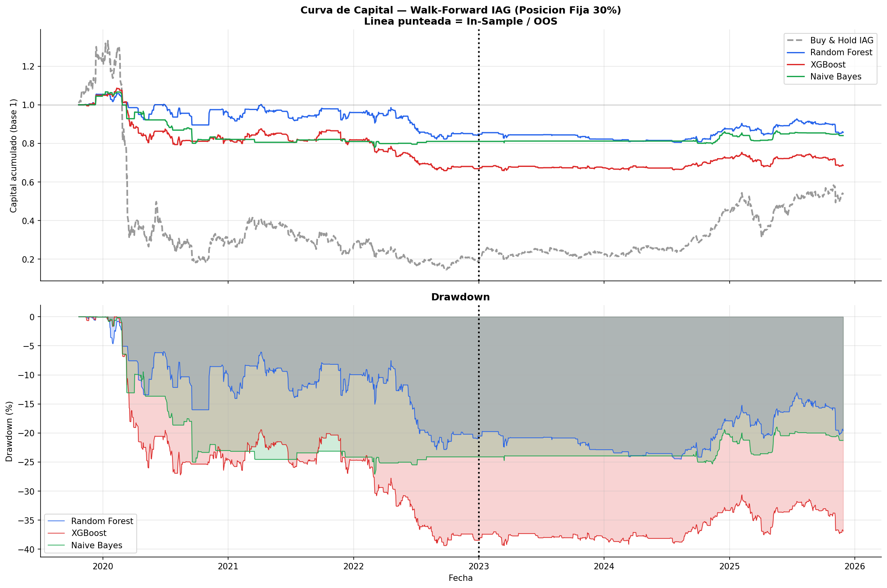
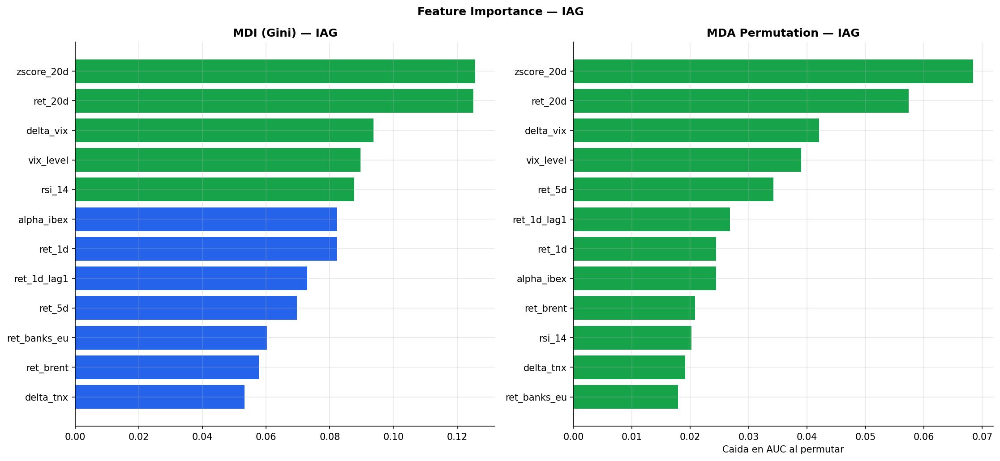

# Actividad 3 — Sistema de Trading Algorítmico sobre IAG (International Airlines Group)

**Notebook:** [`IAG_codigo.ipynb`](IAG_codigo.ipynb)

> El notebook original pesaba ~136 MB porque el bucle de walk-forward volcaba en cada iteración
> los warnings internos de scikit-learn a la salida estándar (ruido sin valor analítico). Se ha
> limpiado esa salida redundante conservando el 100% del código, las celdas de texto, las métricas
> y las figuras generadas.

## Objetivo

Construir y evaluar de forma rigurosa (sin *look-ahead bias* ni sobreajuste) un sistema de trading
algorítmico diario sobre **IAG.MC**, combinando ingeniería de features, etiquetado por
*Triple-Barrier*, modelos de Machine Learning y validación *walk-forward* con coste de
transacción.

### Por qué IAG

1. Mayor volatilidad estructural (~35-45% anual) → barreras del Triple-Barrier más anchas y
   etiquetas (labels) más limpias.
2. Ciclo post-COVID muy pronunciado → momentum más claro (Moskowitz et al., 2012).
3. Fuerte sensibilidad al Brent (25-30% de los costes operativos de una aerolínea) → features
   macro más predictivas.
4. Mercado menos eficiente que valores como BBVA → en teoría, más anomalías explotables por ML.

## Pipeline (bloques del notebook)

### Bloque 1 — Carga de datos y EDA
Precio diario ajustado de IAG (2015-2025), análisis de volatilidad rolling (60 días, usada como
input del Triple-Barrier), distribución de retornos (curtosis ≈ 17.5 → colas muy pesadas) y
correlación con el Brent.

### Bloque 2 — Feature Engineering
Variables técnicas y macro: retornos a varios horizontes (`ret_1d`, `ret_5d`, `ret_20d`), z-score
de 20 días, RSI(14), nivel y variación del VIX, variación de tipos (TNX), retorno del Brent,
retorno del sector bancario europeo, alpha vs IBEX.

### Bloque 3 — Triple-Barrier Labeling
Metodología de **López de Prado** para etiquetar cada observación según cuál de tres barreras se
toca primero: *take-profit*, *stop-loss* o límite temporal. Evita el sesgo de los horizontes fijos
(p.ej. "¿sube en 5 días?") y adapta el horizonte de la operación a la volatilidad real del momento.

### Bloque 4 — Modelos con Purged K-Fold CV
Random Forest y XGBoost, validados con **Purged K-Fold Cross-Validation**: una validación cruzada
que elimina (purga) las observaciones de entrenamiento cuyo horizonte temporal se solapa con el de
test, evitando fuga de información (*data leakage*) típica de series temporales con etiquetas que
dependen de ventanas futuras.

| Modelo | AUC | AUC std | Precision (1) | Recall (1) | F1 (1) |
|---|---|---|---|---|---|
| Random Forest | 0.5335 | 0.0300 | 0.3431 | 0.3933 | 0.3665 |
| **XGBoost** | **0.5448** | 0.0235 | 0.3619 | 0.4513 | 0.4017 |

Variables más importantes (MDA — Mean Decrease Accuracy): `zscore_20d`, `ret_20d`, `delta_vix`,
`vix_level`, `ret_5d`.

### Bloque 5+6 — Walk-Forward Backtest con posición fija del 30%
Reentrenamiento periódico (cada 20 días) sobre una ventana móvil de 756 días (~3 años), simulando
cómo operaría el sistema en producción. **Sizing**: con un AUC de ~0.51-0.54 el criterio de Kelly
fraccional daría posiciones inferiores al 2% (insuficientes para cubrir costes de transacción), por
lo que se usa una posición fija del 30% para garantizar una participación significativa (Thorp,
2006).

## Resultados — Métricas financieras

### Out-of-Sample (2023-2025), el periodo que realmente importa

| Estrategia | ROI anualizado | Sharpe | Sortino | Max Drawdown | Hit Ratio | Profit Factor |
|---|---|---|---|---|---|---|
| Buy & Hold IAG | **40.98%** | **1.116** | 1.485 | -41.54% | 55.41% | 1.238 |
| Random Forest | 0.36% | -0.624 | -0.447 | -8.35% | 17.28% | 1.030 |
| XGBoost | 0.84% | -0.473 | -0.417 | -9.91% | 21.64% | 1.047 |
| Naive Bayes | 1.22% | -0.840 | -0.433 | -5.42% | 7.39% | 1.199 |

- **Deflated Sharpe Ratio** (Bailey & López de Prado, 2014), que corrige el Sharpe por el número de
  modelos probados: Random Forest DSR ≈ 0, XGBoost DSR ≈ 0 → **ninguno es significativo** frente al
  riesgo de *overfitting* por múltiples pruebas.

### Conclusión (resultado honesto, no "vendido")

En el periodo OOS 2023-2025, **Buy & Hold bate claramente a los modelos de ML** (Sharpe 1.116 vs.
Sharpe negativo en Random Forest y XGBoost). Los modelos reducen mucho el drawdown y la
volatilidad (por tener menos exposición: Hit Ratio bajo implica que están casi siempre fuera o en
posiciones pequeñas), pero no generan alpha positivo. Esto es consistente con un AUC apenas por
encima de 0.5: el edge estadístico es demasiado pequeño para cubrir costes y generar retornos
ajustados a riesgo superiores a simplemente mantener el activo. El análisis crítico detallado de por
qué ocurre esto (régimen de mercado muy alcista en el periodo OOS, coste de oportunidad de estar
fuera del mercado, etc.) se desarrolla en el documento Word de la entrega.

## Gráficos

| EDA y features | Walk-forward: capital y drawdown |
|---|---|
|  |  |

**Importancia de variables (MDI vs MDA permutation):**

## Archivos

- [`IAG_codigo.ipynb`](IAG_codigo.ipynb): notebook completo (EDA → features → Triple-Barrier →
  modelos → backtest).
- [`iag_backtest_metrics.csv`](iag_backtest_metrics.csv): métricas financieras completas
  (in-sample, OOS y periodo completo) de todas las estrategias.
